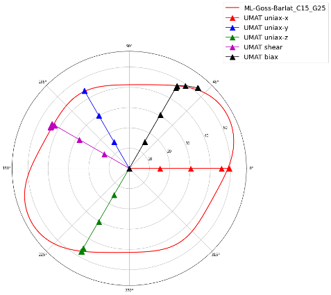
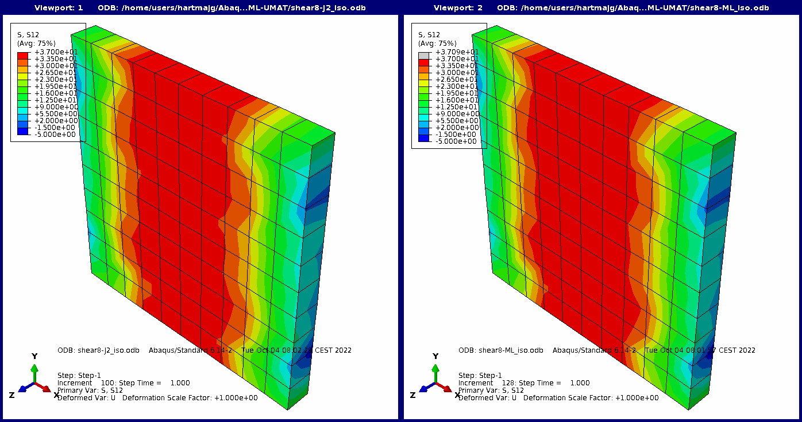
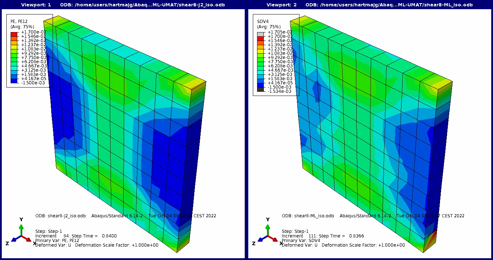

# Application of trained ML flow rule as Abaqus UMAT
To run the examples of the Abaqus UMAT containing the trained ML flow rule in form of support vectors, dual coefficients and other required parameters, an installation of the commercial FE tool Abaqus (Dassault Systems) is required.

## Example 1: Calculate stress-strain curves with 1-element model
The python script 'calc\_properties.py' contains the necessary instructions to modify and execute the Abaqus stack defined in 'femBlock.inp' under different load cases: uniaxial stress along x, y, and z-direction, equibiaxial tension and pure shear. The script has to be run under abaqus python with the additional argument of a material name. It is expected that a file 'models/abq\_{material\_name}-svm.csv' exisits together with the meta data file 'models/abq\_{material\_name}-svm\_meta.json'. The following pre-trained models are a part of this package (material_name):

 * ML-J2\_C15\_G25
 * ML-Hill-p1\_C15\_G25
 * ML-Goss-Barlat\_C15\_G25

These models have been generated with the python scripts contained in the subfolder 'examples' of this package. These examples can be modified easily to train further material models with different characteristics within pyLabFEA. To start the sequence of Abaqus jobs calculating the stress-strain curves under the given load cases for a specified material execute the command

```
$ abaqus python calc_properties.py {material_name}
```
The results will be stored in form of CSV and JSON files in the subfolder 'results'. The following figures gives a graphical representation of the resulting stresses on the pi-plane (plane of deviatoric stresses in principa stress space) together with the yield locus for the material model ML-Goss-Barlat\_C15\_G25.  


## Example 2: Simulation of simple shear on a thin plate
In this example, trained ML flow rules are used as constitutive models during the application of simple shear boundary conditions on a thin plate. The FE model is represented in the Abaqus stack 'plate_shear.inp' and the 'umat\_ml.f' subroutine is invoked directly in Abaqus jobs by the command

```
$ abaqus job=shear_iso_ML inp=plate_shear.inp user=ml_umat.f int
```

The example provided here uses an ML flow rule that has been trained on isotropic material with the python script 'example/Train\_J2.py'. Other trained material models can be included by changing lines 402 and 403 in the file 'plate_shear.inp'. The in-built J2 plasticity model can be invoked by changing line 370 into:  
```*Solid Section, elset=Set-2, material=Material-J2```  

The following figures provide a comparison of the results obtained for J2 plasticity (left) and the ML flow rule (right) of a corresponding isotropic material. In the first figure it is seen that the stresses obtained from both material models agree to a very good degree.  

The resulting plastic shear strains exhibit some quantitative deviations between J2 plasticity (left) and the ML flow rule (right).  



